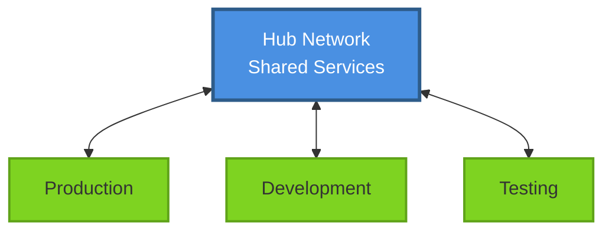
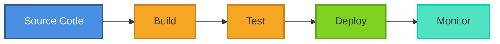

# Network Diagram Templates

A curated collection of network diagram templates using [Mermaid](https://mermaid.js.org/) syntax. These templates help you visualize network architectures, cloud infrastructure, security zones, DevOps pipelines, and hybrid deployments.

[](https://opensource.org/licenses/MIT)
[](https://mermaid.js.org/)

## 🚀 Quick Start

```bash
# Clone the repository
git clone https://github.com/yourusername/mappingTemplates.git

# Browse templates
cd mappingTemplates/templates

# Open a template and copy the Mermaid code
# Paste into any Mermaid-compatible editor or markdown file
```

## 📁 Template Categories

### 🌩️ Cloud Infrastructure
AWS, Azure, and GCP network architectures
- **AWS VPC with Subnets** - Multi-AZ production VPC design

[Browse Cloud Templates →](./templates/cloud-infrastructure/)

### 🔄 Hybrid Networks
On-premise and cloud connectivity patterns
- **Hub and Spoke Topology** - Centralized network architecture

[Browse Hybrid Templates →](./templates/hybrid/)

### 🔒 Security
DMZ zones, firewalls, and secure architectures
- **DevOps DMZ** - Secure CI/CD infrastructure with network zones

[Browse Security Templates →](./templates/security/)

### 🚀 DevOps
CI/CD pipelines and automation workflows
- **CI/CD Pipeline Flow** - Complete deployment pipeline with gates

[Browse DevOps Templates →](./templates/devops/)

### 🏢 On-Premise
Data center and enterprise networks
- *Templates coming soon*

[Browse On-Premise Templates →](./templates/on-premise/)

## 💡 Example Templates

### Hub and Spoke Network
Perfect for multi-environment isolation and centralized services:



### CI/CD Pipeline
Visualize your deployment workflow:



[See all templates →](./templates/)

## 🎯 Use Cases

- **Cloud Migration Planning** - Design target architectures before migrating
- **Architecture Documentation** - Document existing infrastructure
- **Security Reviews** - Visualize network zones and boundaries
- **DevOps Process Design** - Map out CI/CD workflows
- **Team Communication** - Share architecture decisions
- **Compliance** - Demonstrate network segmentation
- **Training** - Teach network concepts with visuals

## 🛠️ How to Use

### 1. Find a Template
Browse the [templates directory](./templates/) by category to find a template that matches your needs.

### 2. Copy the Mermaid Code
Open the template file and copy the mermaid diagram code (everything between ` ```mermaid ` markers).

### 3. Customize
Replace placeholder text with your actual:
- Network names
- IP addresses
- Component names
- Security zones

### 4. Render
Paste the code into any tool that supports Mermaid:

**Online Editors:**
- [Mermaid Live Editor](https://mermaid.live) - Official editor with instant preview
- [Mermaid Ink](https://mermaid.ink) - Generate PNG/SVG from Mermaid code

**Local Testing:**
- Open `templates/mermaid-test.html` in your browser

**IDE/Editors:**
- VS Code with Mermaid Preview extension
- JetBrains IDEs with Mermaid plugin

**Documentation:**
- GitHub/GitLab markdown files (native support)
- Confluence with Mermaid plugin
- Notion code blocks

## 📝 Template Format

Each template includes:

```yaml
---
title: Template Name
description: What this template visualizes
category: cloud-infrastructure | hybrid | security | devops | on-premise
tags: [relevant, keywords, for, search]
author: Author Name
---
```

Plus:
- **Diagram** - Mermaid visualization
- **How to Use** - Customization instructions
- **Example Use Cases** - Real-world scenarios
- **Architecture Notes** - Best practices and trade-offs

[Read the full Template Guide →](./templates/TEMPLATE-GUIDE.md)

## 🤝 Contributing

We welcome contributions! Here's how you can help:

### Add a New Template
1. Choose the appropriate category directory
2. Follow the [Template Guide](./templates/TEMPLATE-GUIDE.md)
3. Test your Mermaid syntax
4. Submit a pull request

### Suggest Templates
Open an issue with:
- Template category
- Use case description
- Key components to include

### Improve Existing Templates
- Fix Mermaid syntax errors
- Enhance documentation
- Add use cases
- Improve visual styling

See each category README for a list of suggested templates to add.

## 🎨 Mermaid Resources

### Official Documentation
- [Mermaid Docs](https://mermaid.js.org/) - Complete syntax reference
- [Flowchart Syntax](https://mermaid.js.org/syntax/flowchart.html) - Graph diagrams
- [Sequence Diagrams](https://mermaid.js.org/syntax/sequenceDiagram.html) - Interaction flows
- [Tutorials](http://mermaid.js.org/ecosystem/tutorials.html) - Learn Mermaid

### Tools
- [Mermaid Live Editor](https://mermaid.live/) - Online editor
- [Mermaid CLI](https://github.com/mermaid-js/mermaid-cli) - Command-line tool
- [VS Code Extension](https://marketplace.visualstudio.com/items?itemName=bierner.markdown-mermaid) - Preview in editor

### Community
- [Mermaid GitHub](https://github.com/mermaid-js/mermaid) - Source code and issues
- [Discussions](https://github.com/mermaid-js/mermaid/discussions) - Community forum

## 🏗️ Architecture Resources

- [AWS Architecture Center](https://aws.amazon.com/architecture/)
- [Azure Architecture Center](https://docs.microsoft.com/en-us/azure/architecture/)
- [GCP Architecture Framework](https://cloud.google.com/architecture)
- [CNCF Cloud Native Landscape](https://landscape.cncf.io/)
- [The Twelve-Factor App](https://12factor.net/)

## 📊 Project Stats

- **4 Templates** across 5 categories
- **Cloud, Hybrid, Security, DevOps** use cases covered
- **Multi-cloud** support (AWS, Azure, GCP)
- **Production-ready** examples with best practices

## 📄 License

This project is licensed under the MIT License - see the [LICENSE](./LICENSE) file for details.

## 🙋 Support

- **Questions?** Open an issue
- **Feature request?** Open an issue with "enhancement" label
- **Found a bug?** Open an issue with "bug" label
- **Want to contribute?** Check [contributing guidelines](#-contributing)

## 🌟 Acknowledgments

- Built with [Mermaid](https://mermaid.js.org/) - Amazing diagramming tool
- Inspired by network architecture best practices from AWS, Azure, and GCP
- Community-driven template collection

---

**[View Templates](./templates/)** | **[Template Guide](./templates/TEMPLATE-GUIDE.md)** | **[Contributing](#-contributing)**
