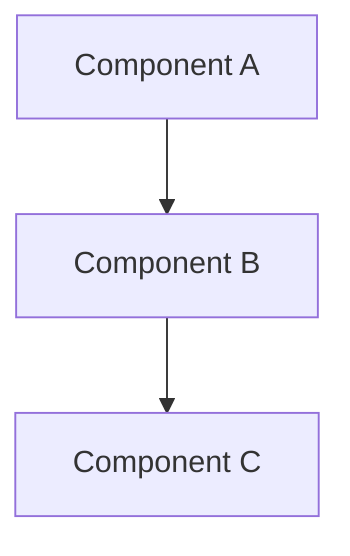
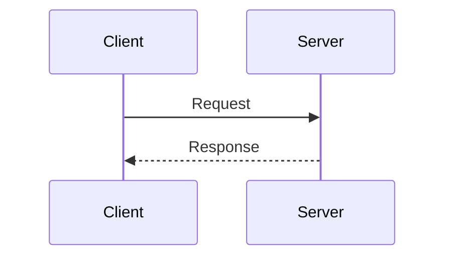

# Network Diagram Templates

A comprehensive collection of network diagram templates using Mermaid syntax for visualizing various network architectures, topologies, and DevOps workflows.

## Quick Start

1. **Browse templates** by category in the directories below
2. **Copy a template** that matches your use case
3. **Customize** the diagram for your specific architecture
4. **Render** using any Mermaid-compatible tool

## Categories

### 🌩️ [Cloud Infrastructure](./cloud-infrastructure/)
Cloud-native architectures for AWS, Azure, GCP, and multi-cloud environments.

**Templates:**
- [AWS VPC with Public and Private Subnets](./cloud-infrastructure/aws-vpc-subnets.md) - Production-ready VPC with multi-AZ deployment

**Use for:** Cloud VPCs/VNets, serverless architectures, container networking, cloud-native applications

---

### 🔄 [Hybrid Networks](./hybrid/)
Architectures combining on-premise and cloud infrastructure, or connecting multiple cloud providers.

**Templates:**
- [Hub and Spoke Network Topology](./hybrid/hub-and-spoke.md) - Centralized hub with multiple spoke networks

**Use for:** Cloud migration, hybrid connectivity, multi-cloud deployments, centralized services

---

### 🔒 [Security](./security/)
Security-focused architectures with DMZ zones, firewalls, and network segmentation.

**Templates:**
- [DevOps DMZ with Build Infrastructure](./security/devops-dmz.md) - Secure DMZ for CI/CD tools and artifact storage

**Use for:** DMZ design, security zones, compliance architectures, DevSecOps infrastructure

---

### 🚀 [DevOps](./devops/)
CI/CD pipelines, deployment workflows, and DevOps automation patterns.

**Templates:**
- [CI/CD Pipeline Flow](./devops/cicd-pipeline-flow.md) - Complete CI/CD workflow with stages and gates

**Use for:** Pipeline design, deployment strategies, automation workflows, release management

---

### 🏢 [On-Premise](./on-premise/)
Traditional data center and enterprise network architectures.

**Templates:** *(Coming soon)*

**Use for:** Data center networks, campus networks, three-tier architectures, traditional IT infrastructure

---

## Template Guide

All templates follow a standard format with:
- **YAML Frontmatter** - Metadata for discovery
- **Mermaid Diagram** - Visual representation
- **How to Use** - Customization instructions
- **Example Use Cases** - Real-world scenarios
- **Best Practices** - Architecture guidance

Read the complete [Template Guide](./TEMPLATE-GUIDE.md) for detailed format specifications.

## Testing Your Diagrams

### Option 1: Local HTML Test File
Open [mermaid-test.html](./mermaid-test.html) in your browser to see all diagrams rendered locally.

### Option 2: Mermaid Live Editor
1. Visit [mermaid.live](https://mermaid.live)
2. Copy your mermaid code
3. Paste into the editor
4. View real-time rendering

### Option 3: VS Code Extension
Install the [Mermaid Preview extension](https://marketplace.visualstudio.com/items?itemName=bierner.markdown-mermaid) to preview diagrams directly in VS Code.

### Option 4: GitHub/GitLab
Both platforms render mermaid diagrams natively in markdown files.

## Common Mermaid Diagram Types

### Graph/Flowchart

**Best for:** Network topology, component relationships, architecture diagrams

### Sequence Diagram

**Best for:** Communication patterns, API flows, message sequences

### Other Types
- **State diagrams** - Network states and transitions
- **Entity relationship** - Data flow and dependencies
- **Gantt charts** - Project timelines and phases

## Rendering Tools

### Online Editors
- [Mermaid Live Editor](https://mermaid.live) - Official online editor
- [Mermaid Ink](https://mermaid.ink) - Generate diagram images from URLs
- [SimpleMermaid](https://simplemermaid.com) - Simplified editor interface

### IDE Extensions
- **VS Code**: Mermaid Preview, Markdown Preview Mermaid Support
- **JetBrains**: Mermaid plugin
- **Atom**: Markdown Preview Plus

### Documentation Platforms
- **GitHub/GitLab**: Native markdown rendering
- **Confluence**: Mermaid plugin
- **Notion**: Mermaid code blocks
- **Obsidian**: Native support

### Static Site Generators
- **MkDocs**: pymdown-extensions
- **Hugo**: Mermaid shortcode
- **Jekyll**: jekyll-mermaid plugin
- **Docusaurus**: @docusaurus/theme-mermaid

## Quick Reference

### Node Shapes
```
[Rectangle]
(Rounded Rectangle)
([Stadium])
[[Subroutine]]
[(Database)]
((Circle))
{Diamond}
{{Hexagon}}
```

### Connection Types
```
--> Solid arrow
--- Solid line
-.-> Dotted arrow
-.- Dotted line
==> Thick arrow
<--> Bidirectional
```

### Styling
```
style NodeID fill:#color,stroke:#color,stroke-width:2px
```

## Contributing

We welcome contributions! To add a new template:

1. Choose the appropriate category directory
2. Create a `.md` file following the [Template Guide](./TEMPLATE-GUIDE.md)
3. Include all required sections (frontmatter, diagram, usage, examples)
4. Test your Mermaid syntax
5. Add your template to the category README
6. Submit a pull request

See the category README files for suggested templates to add.

## Resources

### Mermaid Documentation
- [Official Mermaid Docs](https://mermaid.js.org/)
- [Mermaid Syntax Guide](https://mermaid.js.org/intro/)
- [Mermaid GitHub](https://github.com/mermaid-js/mermaid)

### Network Architecture References
- [AWS Architecture Center](https://aws.amazon.com/architecture/)
- [Azure Architecture Center](https://docs.microsoft.com/en-us/azure/architecture/)
- [GCP Architecture Framework](https://cloud.google.com/architecture)
- [Kubernetes Networking](https://kubernetes.io/docs/concepts/cluster-administration/networking/)

### Best Practices
- [The Twelve-Factor App](https://12factor.net/)
- [AWS Well-Architected Framework](https://aws.amazon.com/architecture/well-architected/)
- [Azure Well-Architected Framework](https://docs.microsoft.com/en-us/azure/architecture/framework/)
- [CNCF Cloud Native Landscape](https://landscape.cncf.io/)

## Template Statistics

- **Total Templates**: 4
- **Categories**: 5
- **Diagram Types**: Graphs, Flowcharts, Sequence Diagrams
- **Cloud Providers**: AWS, Azure, GCP
- **Use Cases**: Cloud, Hybrid, Security, DevOps, On-Premise

## License

This project is licensed under the MIT License - see the [LICENSE](../LICENSE) file for details.

## Support

For questions, issues, or suggestions:
- Open an issue in the repository
- Check existing templates for examples
- Review the [Template Guide](./TEMPLATE-GUIDE.md)
- Visit [Mermaid documentation](https://mermaid.js.org/)
