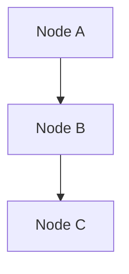
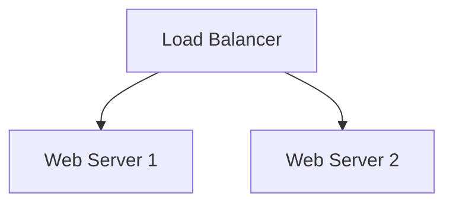
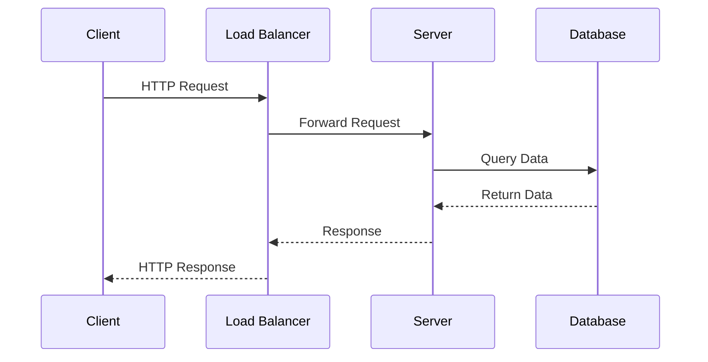

# Template Guide

This guide explains how to create and use network diagram templates in this repository.

## Template Format

All templates are authored using Mermaid diagram syntax and stored as Markdown files (`.md`) with embedded Mermaid code blocks.

### File Structure

Each template file must contain:

1. **YAML Frontmatter** - Structured metadata
2. **Title and Description** - Clear explanation of the template
3. **Mermaid Diagram** - The actual network visualization
4. **How to Use Section** - Instructions for customization
5. **Example Use Cases** - At least one concrete example

### Template Structure Example

```markdown
---
title: Example Network Template
description: A brief description of what this template visualizes
category: cloud-infrastructure
tags: [aws, vpc, networking, cloud]
author: Your Name
---

# Example Network Template

Brief description of the network architecture pattern.

## Diagram



## How to Use

1. Copy this template
2. Customize node labels to match your architecture
3. Adjust connections as needed
4. Update metadata in frontmatter

## Example Use Cases

- Use Case 1: Description of when to use this template
- Use Case 2: Another scenario where this applies

## Customization Points

- Node A: Replace with your specific component
- Node B: Adjust based on your requirements
```

## Metadata Requirements

All templates MUST include YAML frontmatter with these fields:

- `title`: The name of the template
- `description`: Clear explanation of the network architecture pattern
- `category`: One of: cloud-infrastructure, on-premise, hybrid, security, devops
- `tags`: Array of relevant keywords for searchability
- `author`: Template creator's name or identifier

## Mermaid Diagram Types

Templates may use any of these Mermaid diagram types:

### Flowchart (graph TD/LR)
Best for showing network topology and component relationships.



### Sequence Diagrams
Best for showing communication patterns and message flow.



### Other Diagram Types
- State diagrams for network states
- Entity relationship diagrams for data flow
- C4 diagrams for architectural context

## Naming Conventions

- **Files**: Use lowercase with hyphens (e.g., `hub-and-spoke.md`)
- **Node Labels**: Use clear, descriptive names
- **IDs**: Use consistent naming across templates

## Categories

Templates are organized into these categories:

- **cloud-infrastructure**: Cloud-native architectures (AWS, Azure, GCP)
- **on-premise**: Traditional data center networks
- **hybrid**: Combination of cloud and on-premise
- **security**: Security-focused architectures (DMZ, firewalls, zones)
- **devops**: CI/CD pipelines and automation workflows

## Validation

Before submitting a template, ensure:

1. Mermaid syntax is valid (test in [Mermaid Live Editor](https://mermaid.live))
2. All required metadata fields are present
3. Diagram nodes have clear, descriptive labels
4. "How to Use" section is complete
5. At least one example use case is provided

## Contributing

When adding a new template:

1. Choose the appropriate category directory
2. Follow the naming convention
3. Include all required sections
4. Test the Mermaid syntax
5. Add an entry to the category's README.md
