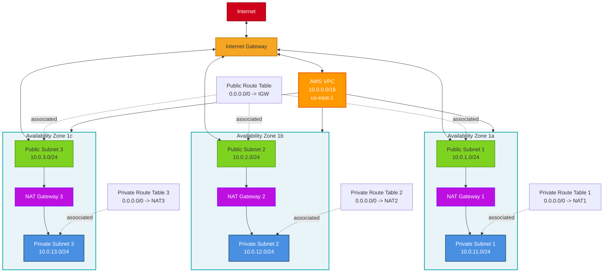
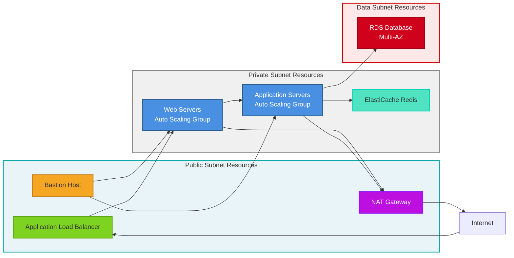

# AWS VPC with Public and Private Subnets

A production-ready AWS VPC design with multi-AZ deployment, public subnets for internet-facing resources, and private subnets for backend services. This architecture provides high availability, security, and scalability.

## Diagram



## Detailed Component View



## How to Use

1. **Copy this template** to create your VPC architecture
2. **Customize the VPC CIDR block**:
   - Choose an appropriate CIDR range (e.g., `10.0.0.0/16`)
   - Ensure it doesn't overlap with other VPCs or on-premise networks
3. **Define subnet ranges**:
   - Public subnets: Use smaller CIDR blocks (e.g., `/24` gives 256 IPs)
   - Private subnets: Allocate larger ranges for more instances
   - Leave room for future subnet additions
4. **Select availability zones**:
   - Use at least 2 AZs for high availability
   - Add 3 AZs for production workloads
   - Adjust based on your region's available AZs
5. **Configure NAT Gateway strategy**:
   - **High Availability**: One NAT Gateway per AZ (higher cost)
   - **Cost Optimized**: Single NAT Gateway in one AZ
   - **Hybrid**: NAT Gateway in 2 AZs for balance
6. **Add security layers**:
   - Configure Security Groups for each tier
   - Set up Network ACLs for subnet-level filtering
   - Implement VPC Flow Logs for monitoring

## Example Use Cases

### Three-Tier Web Application
Deploy a classic web application with load balancers in public subnets, application servers in private subnets, and databases in isolated data subnets.

### Microservices Architecture
Run containers (ECS/EKS) in private subnets with Application Load Balancer in public subnets for ingress traffic.

### Hybrid Cloud Connection
Connect this VPC to on-premise data centers using VPN or AWS Direct Connect through a Virtual Private Gateway.

### Multi-Region Application
Replicate this VPC architecture in multiple regions with VPC peering or Transit Gateway for global applications.

### Development/Staging Environment
Create a smaller version of this architecture for non-production environments with fewer AZs and resources.

## Customization Points

- **VPC CIDR**: Change `10.0.0.0/16` to your preferred address range
- **Region**: Replace `us-east-1` with your target AWS region
- **Availability Zones**: Adjust number of AZs (2 minimum, 3 recommended)
- **Subnet Sizing**: Modify CIDR blocks based on expected instance count
- **NAT Gateway**: Choose HA vs cost-optimized NAT strategy
- **Additional Subnets**: Add database subnets, DMZ, or dedicated subnets for specific services
- **VPN/Direct Connect**: Add Virtual Private Gateway for hybrid connectivity

## Architecture Components

### VPC (Virtual Private Cloud)
The logical isolation of your AWS resources with a defined CIDR block.

### Internet Gateway
Enables communication between VPC and the internet for public subnets.

### NAT Gateway
Allows instances in private subnets to access the internet for updates and patches while remaining private.

### Public Subnets
- Have routes to Internet Gateway
- Host internet-facing resources (load balancers, bastion hosts)
- Instances get public IP addresses

### Private Subnets
- Route internet traffic through NAT Gateway
- Host application servers, compute resources
- Instances only have private IP addresses
- Protected from direct internet access

### Route Tables
- Public Route Table: Routes `0.0.0.0/0` to Internet Gateway
- Private Route Tables: Routes `0.0.0.0/0` to NAT Gateway (per AZ)

## Cost Considerations

### NAT Gateway Costs
- **Per Hour**: ~$0.045 per hour per NAT Gateway
- **Data Processing**: ~$0.045 per GB processed
- **Multi-AZ**: 3 NAT Gateways = ~$97/month + data transfer

### Cost Optimization Options
1. **Single NAT Gateway**: Use one NAT in a single AZ (lower HA)
2. **NAT Instance**: Use EC2 NAT instance instead (more management)
3. **VPC Endpoints**: Use for AWS services (S3, DynamoDB) to avoid NAT costs
4. **PrivateLink**: Direct access to AWS services without internet

## Security Best Practices

### Network Segmentation
- Separate public and private resources
- Use separate subnets for different tiers (web, app, data)
- Implement least privilege access

### Security Groups
- Stateful firewall at instance level
- Only open required ports
- Use security group references instead of CIDR blocks

### Network ACLs
- Stateless firewall at subnet level
- Add an additional layer of defense
- Consider default deny rules

### Flow Logs
- Enable VPC Flow Logs for traffic analysis
- Store logs in CloudWatch or S3
- Monitor for unusual patterns

### Encryption
- Use TLS/SSL for data in transit
- Enable encryption at rest for storage
- Use AWS PrivateLink for service communication

## Terraform Example

```hcl
resource "aws_vpc" "main" {
  cidr_block           = "10.0.0.0/16"
  enable_dns_hostnames = true
  enable_dns_support   = true

  tags = {
    Name = "main-vpc"
  }
}

resource "aws_subnet" "public" {
  count                   = 3
  vpc_id                  = aws_vpc.main.id
  cidr_block              = "10.0.${count.index + 1}.0/24"
  availability_zone       = data.aws_availability_zones.available.names[count.index]
  map_public_ip_on_launch = true

  tags = {
    Name = "public-subnet-${count.index + 1}"
  }
}

resource "aws_subnet" "private" {
  count             = 3
  vpc_id            = aws_vpc.main.id
  cidr_block        = "10.0.${count.index + 11}.0/24"
  availability_zone = data.aws_availability_zones.available.names[count.index]

  tags = {
    Name = "private-subnet-${count.index + 1}"
  }
}
```

## CloudFormation Example

```yaml
Resources:
  VPC:
    Type: AWS::EC2::VPC
    Properties:
      CidrBlock: 10.0.0.0/16
      EnableDnsHostnames: true
      EnableDnsSupport: true
      Tags:
        - Key: Name
          Value: main-vpc
```
