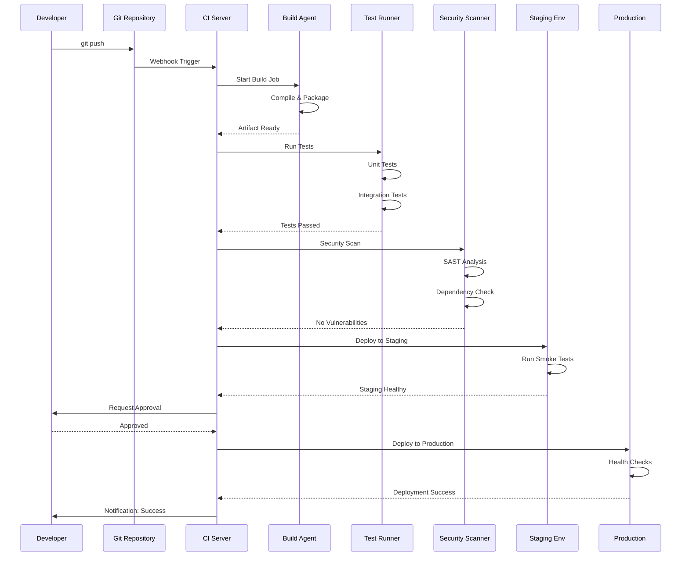

# CI/CD Pipeline Flow

A CI/CD (Continuous Integration/Continuous Deployment) pipeline automates the process of building, testing, and deploying applications. This template shows a standard pipeline workflow with multiple stages and decision points.

## Diagram

```mermaid
graph LR
    Dev[Developer<br/>Commits Code]
    SCM[Source Control<br/>Git Repository]

    Trigger{Pipeline<br/>Triggered}

    Build[Build Stage<br/>Compile & Package]
    BuildFail{Build<br/>Success?}

    Test[Test Stage<br/>Unit & Integration Tests]
    TestFail{Tests<br/>Pass?}

    Security[Security Scan<br/>SAST/Dependency Check]
    SecFail{Security<br/>Pass?}

    Stage[Deploy to Staging<br/>QA Environment]
    StageFail{Staging<br/>Tests Pass?}

    Approval{Manual<br/>Approval?}

    Prod[Deploy to Production<br/>Blue-Green/Canary]
    ProdFail{Production<br/>Health OK?}

    Notify[Notify Team<br/>Success]
    NotifyFail[Notify Team<br/>Failure & Rollback]

    Dev --> SCM
    SCM --> Trigger
    Trigger -->|Yes| Build
    Trigger -->|No| Dev

    Build --> BuildFail
    BuildFail -->|Yes| Test
    BuildFail -->|No| NotifyFail

    Test --> TestFail
    TestFail -->|Yes| Security
    TestFail -->|No| NotifyFail

    Security --> SecFail
    SecFail -->|Yes| Stage
    SecFail -->|No| NotifyFail

    Stage --> StageFail
    StageFail -->|Yes| Approval
    StageFail -->|No| NotifyFail

    Approval -->|Approved| Prod
    Approval -->|Rejected| NotifyFail

    Prod --> ProdFail
    ProdFail -->|Yes| Notify
    ProdFail -->|No| NotifyFail

    NotifyFail --> Dev

    style Dev fill:#4A90E2,stroke:#2E5C8A,stroke-width:2px,color:#fff
    style SCM fill:#7ED321,stroke:#5FA319,stroke-width:2px
    style Build fill:#F5A623,stroke:#C77F1B,stroke-width:2px
    style Test fill:#F5A623,stroke:#C77F1B,stroke-width:2px
    style Security fill:#F5A623,stroke:#C77F1B,stroke-width:2px
    style Stage fill:#BD10E0,stroke:#9012FE,stroke-width:2px,color:#fff
    style Prod fill:#50E3C2,stroke:#00D4B4,stroke-width:2px
    style Notify fill:#7ED321,stroke:#5FA319,stroke-width:3px
    style NotifyFail fill:#D0021B,stroke:#A00116,stroke-width:3px,color:#fff
    style Trigger fill:#F8E71C,stroke:#D4C116,stroke-width:2px
    style BuildFail fill:#F8E71C,stroke:#D4C116,stroke-width:2px
    style TestFail fill:#F8E71C,stroke:#D4C116,stroke-width:2px
    style SecFail fill:#F8E71C,stroke:#D4C116,stroke-width:2px
    style StageFail fill:#F8E71C,stroke:#D4C116,stroke-width:2px
    style Approval fill:#F8E71C,stroke:#D4C116,stroke-width:2px
    style ProdFail fill:#F8E71C,stroke:#D4C116,stroke-width:2px
```



## Sequence Diagram View

For understanding the timing and interaction between components:



## How to Use

1. **Copy this template** to design your CI/CD pipeline
2. **Customize the stages**:
   - Add or remove stages based on your requirements
   - Common additions: Code quality checks, performance tests, container scanning
3. **Define your tools**:
   - Replace generic names with your actual tools (Jenkins, GitHub Actions, GitLab CI, etc.)
   - Update node labels to match your tooling
4. **Configure decision points**:
   - Add quality gates and approval steps
   - Define rollback strategies
5. **Adjust deployment strategy**:
   - Choose between blue-green, canary, or rolling deployments
   - Add multiple environment stages if needed

## Example Use Cases

### Microservices Deployment
Deploy multiple microservices with independent pipelines that can run in parallel, each with their own testing and deployment stages.

### Mobile App Release
Add stages for app signing, store submission, beta testing, and phased rollout to production.

### Infrastructure as Code
Pipeline for validating, testing, and applying Terraform/CloudFormation changes with approval gates.

### Multi-Environment Deployment
Extend the pipeline with additional environments (dev, test, QA, pre-prod, prod) with progressive validation.

### Containerized Applications
Add container build, image scanning, registry push, and Kubernetes deployment stages.

## Customization Points

- **Source Control**: Replace with GitHub, GitLab, Bitbucket, etc.
- **Build Tools**: Maven, Gradle, npm, Docker, etc.
- **Test Frameworks**: JUnit, pytest, Jest, Selenium, etc.
- **Security Tools**: SonarQube, Snyk, OWASP Dependency-Check, Trivy
- **Deployment Targets**: Kubernetes, AWS ECS, Azure App Service, VMs
- **Notification Channels**: Slack, email, Microsoft Teams, PagerDuty
- **Approval Process**: Manual approval, automated based on metrics, time-based windows

## Pipeline Stages Explained

### Build Stage
- Compile source code
- Resolve dependencies
- Create build artifacts (JAR, container image, etc.)
- Cache dependencies for faster builds

### Test Stage
- Unit tests (fast, isolated tests)
- Integration tests (component interactions)
- Code coverage analysis
- API contract tests

### Security Scan
- Static Application Security Testing (SAST)
- Dependency vulnerability scanning
- Container image scanning (if applicable)
- License compliance checks

### Staging Deployment
- Deploy to QA/staging environment
- Run smoke tests
- Perform acceptance testing
- Load/performance testing

### Production Deployment
- Blue-green or canary deployment
- Health checks and monitoring
- Automatic rollback on failure
- Traffic shifting and validation

## Best Practices

### Fast Feedback
- Keep build and test stages fast (under 10 minutes)
- Run quick tests first, slower tests later
- Fail fast on critical issues

### Automation
- Minimize manual intervention
- Automate all environment provisioning
- Use infrastructure as code

### Security
- Scan early and often
- Fail builds on critical vulnerabilities
- Use secrets management (not hardcoded)

### Observability
- Log all pipeline activities
- Monitor pipeline performance
- Track deployment frequency and success rate
- Alert on failures immediately

### Rollback Strategy
- Always have a rollback plan
- Test rollback procedures regularly
- Maintain previous version artifacts
- Implement automatic rollback on failure

## Tool-Specific Implementation

### GitHub Actions
```yaml
on: [push]
jobs:
  build:
    runs-on: ubuntu-latest
    steps:
      - uses: actions/checkout@v2
      - name: Build
      - name: Test
      - name: Security Scan
      - name: Deploy
```

### GitLab CI
```yaml
stages:
  - build
  - test
  - security
  - deploy
```

### Jenkins
Use declarative pipeline with stages matching this flow diagram.

### CircleCI
Configure workflows with jobs for each stage and approval steps.
