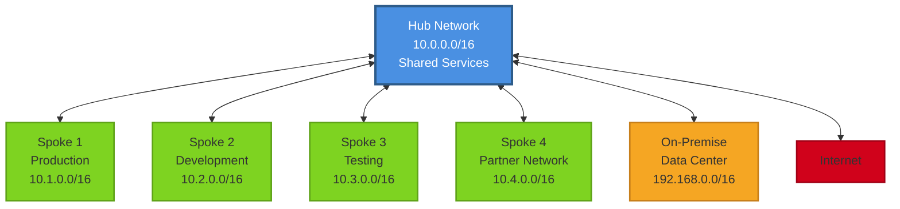

# Hub and Spoke Network Topology

The hub and spoke topology is a network architecture pattern where a central hub network is connected to multiple spoke networks. All inter-spoke traffic flows through the hub, which provides centralized control, security, and shared services.

## Diagram

## How to Use

1. **Copy this template** to create your own hub and spoke architecture
2. **Customize the hub network**:
   - Update the CIDR block (e.g., `10.0.0.0/16`)
   - Add shared services (DNS, monitoring, security, etc.)
3. **Define your spoke networks**:
   - Rename spokes based on your environment names
   - Update CIDR blocks to match your IP addressing scheme
   - Add or remove spokes as needed
4. **Configure connections**:
   - Add VPN/Express Route connections for on-premise
   - Configure NAT Gateway or Internet Gateway for internet access
   - Set up VNet peering (Azure) or Transit Gateway (AWS)
5. **Apply network policies**:
   - Define routing rules for inter-spoke communication
   - Implement security groups/NSGs at hub and spoke levels
   - Configure firewall rules at the hub

## Example Use Cases

### Multi-Environment Isolation
Separate production, development, and testing environments into different spokes while maintaining centralized security and monitoring in the hub.

### Partner Network Integration
Connect partner or vendor networks as isolated spokes with controlled access to specific hub resources.

### Hybrid Cloud Architecture
Connect on-premise data centers to cloud environments through the hub, enabling gradual cloud migration while maintaining connectivity.

### Centralized Security Services
Deploy firewalls, intrusion detection systems, and security monitoring in the hub to protect all spoke networks.

### Shared Services Hub
Host shared services (Active Directory, DNS, NTP, monitoring) in the hub that all spokes can access without exposing them to each other.

## Customization Points

- **Hub Network**: Replace with your hub VNet/VPC name and CIDR
- **Spoke Networks**: Add, remove, or rename spokes based on your requirements
- **On-Premise Connection**: Adjust or remove if not using hybrid connectivity
- **Internet Gateway**: Customize based on internet access requirements
- **CIDR Blocks**: Update all IP address ranges to match your addressing scheme
- **Styling**: Modify colors to match your architecture diagram standards

## Architecture Considerations

### Advantages
- Centralized management and security
- Simplified network design
- Easier to implement network policies
- Cost-effective for shared services
- Scalable by adding more spokes

### Trade-offs
- Hub becomes a single point of failure (mitigate with redundancy)
- Additional latency for inter-spoke communication
- Hub bandwidth limitations may affect performance
- More complex routing configuration

## Implementation Notes

### Azure
Use VNet Peering to connect spokes to hub, with Azure Firewall or NVA in the hub for traffic inspection.

### AWS
Use AWS Transit Gateway to connect VPCs in a hub and spoke pattern, with centralized routing and security.

### Multi-Region
For multi-region deployments, consider a regional hub in each region with inter-hub connectivity.
