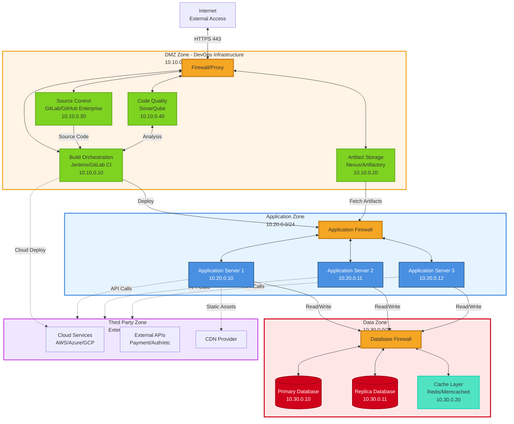
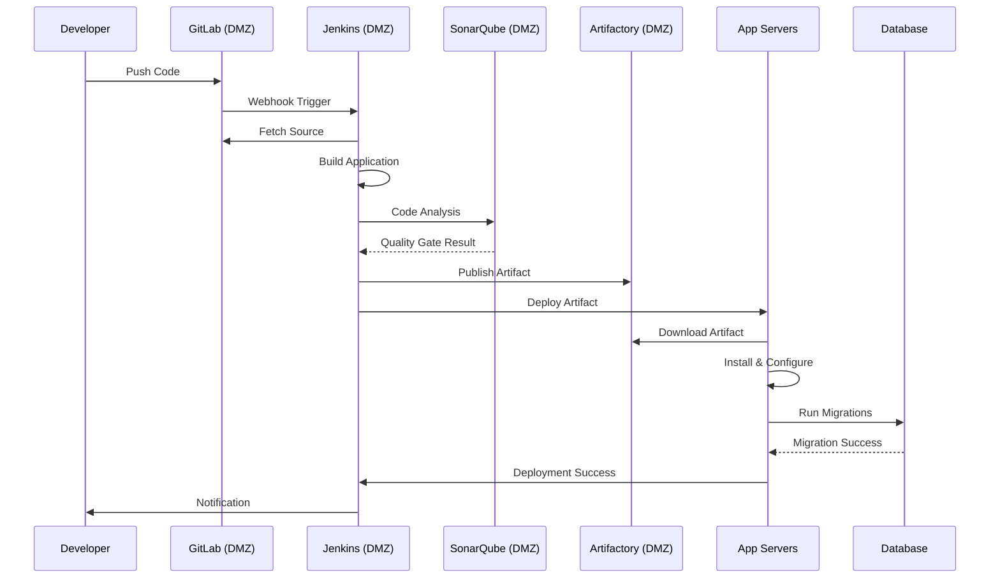
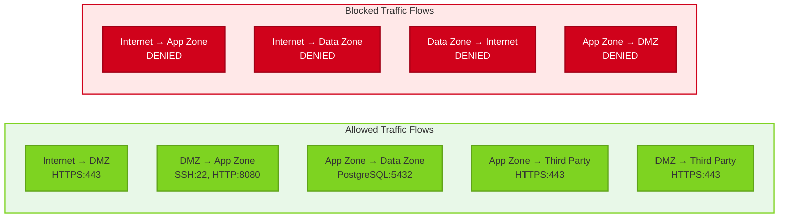

# DevOps DMZ with Build and Artifact Infrastructure

This architecture implements a secure DMZ (Demilitarized Zone) specifically designed for DevOps infrastructure. The DMZ contains build and release orchestration tools along with artifact storage, providing controlled access to application servers while maintaining security boundaries.

## Diagram



## Deployment Flow



## Traffic Flow Rules



## How to Use

1. **Copy this template** to design your DevOps DMZ architecture
2. **Customize the DMZ zone**:
   - Add or remove DevOps tools based on your stack
   - Adjust IP ranges to match your network schema
   - Consider tools like: Jenkins, GitLab CI, Nexus, Artifactory, Harbor, SonarQube
3. **Define application zone**:
   - Specify application server types (VMs, containers, Kubernetes)
   - Configure load balancing and auto-scaling
   - Set up monitoring and logging
4. **Configure data zone**:
   - Choose database type (PostgreSQL, MySQL, MongoDB, etc.)
   - Implement replication and backup strategies
   - Add caching layers for performance
5. **Set up firewall rules**:
   - Define allowed ports and protocols
   - Implement least privilege access
   - Configure network ACLs and security groups
6. **Integrate third-party services**:
   - Map external dependencies (cloud providers, APIs, CDNs)
   - Configure secure API access
   - Implement API gateways if needed

## Example Use Cases

### Continuous Deployment Pipeline
Build, test, and deploy applications automatically from the DMZ to application servers with artifact versioning and rollback capabilities.

### Multi-Environment Deployment
Replicate this pattern for dev, staging, and production environments with separate DMZ zones and strict promotion policies.

### Container Registry Hosting
Host private Docker registry in DMZ for secure container image storage and distribution to Kubernetes clusters in the application zone.

### Security Scanning and Compliance
Integrate security scanning tools (Aqua, Twistlock, Clair) in the DMZ to scan artifacts before deployment to production.

### Hybrid Cloud Deployment
Deploy applications to both on-premise servers and cloud environments from the same DMZ infrastructure.

## Customization Points

- **DMZ Tools**: Replace with your specific DevOps toolchain
- **IP Addressing**: Adjust CIDR blocks to match your network design
- **Firewall Rules**: Customize based on security requirements
- **Application Servers**: Specify technology stack (Java, .NET, Node.js, etc.)
- **Database Type**: Change to your database platform
- **Third-Party Integrations**: Add specific external services you use
- **Authentication**: Integrate with SSO/LDAP/Active Directory
- **Monitoring**: Add observability tools (Prometheus, Grafana, ELK)

## Security Architecture

### Zone Isolation
Each network zone is isolated with firewalls enforcing strict access control between zones.

### DMZ Zone (10.10.0.0/24)
- **Purpose**: Host DevOps infrastructure
- **Access**: Limited internet access via firewall/proxy
- **Outbound**: Can deploy to app zone and cloud services
- **Inbound**: Restricted to HTTPS from internet and internal networks

### Application Zone (10.20.0.0/24)
- **Purpose**: Host application servers
- **Access**: No direct internet access
- **Inbound**: Only from DMZ (deployments) and load balancers
- **Outbound**: Can access data zone and third-party APIs

### Data Zone (10.30.0.0/24)
- **Purpose**: Host databases and cache
- **Access**: No internet access
- **Inbound**: Only from application zone
- **Outbound**: None (except replication to DR site)

### Third-Party Zone
- **Purpose**: External services and APIs
- **Access**: Via HTTPS with API keys/tokens
- **Monitoring**: Track all external calls for compliance

## Firewall Rules

### DMZ Firewall
```
Allow: Internet → DMZ:443 (HTTPS for web UI access)
Allow: Internal Network → DMZ:443,22 (Admin access)
Allow: DMZ → App Zone:22,8080 (Deployment)
Allow: DMZ → Third Party:443 (Cloud deployments, API calls)
Deny: All other traffic
```

### Application Firewall
```
Allow: DMZ → App Zone:22,8080 (Deployment traffic)
Allow: Load Balancer → App Zone:8080 (Application traffic)
Allow: App Zone → Data Zone:5432,6379 (Database/cache)
Allow: App Zone → Third Party:443 (API calls)
Deny: App Zone → DMZ (Prevent reverse connections)
Deny: All other traffic
```

### Database Firewall
```
Allow: App Zone → Data Zone:5432,6379
Allow: Data Zone → Data Zone:5432 (Replication)
Deny: All other traffic
```

## Components Explained

### Build Orchestration (Jenkins/GitLab CI)
- Automates build, test, and deployment workflows
- Coordinates artifact creation and distribution
- Manages deployment pipelines across environments

### Artifact Storage (Nexus/Artifactory)
- Stores build artifacts, packages, and dependencies
- Provides artifact versioning and management
- Acts as proxy for external package repositories

### Source Control (GitLab/GitHub Enterprise)
- Hosts source code repositories
- Triggers CI/CD pipelines on code changes
- Manages branching and merge workflows

### Code Quality (SonarQube)
- Performs static code analysis
- Enforces quality gates
- Tracks technical debt and security vulnerabilities

### Application Servers
- Host application instances
- Auto-scale based on load
- Pull artifacts from DMZ on deployment

### Database Layer
- Primary database for write operations
- Read replicas for query performance
- Cache layer for frequently accessed data

## Best Practices

### Security
- Use service accounts with minimal permissions
- Rotate credentials regularly
- Encrypt data in transit (TLS) and at rest
- Implement network segmentation with firewalls
- Enable audit logging for all actions
- Use bastion hosts for administrative access

### High Availability
- Deploy redundant instances of critical services
- Use load balancers for application servers
- Implement database replication
- Configure automatic failover
- Test disaster recovery procedures

### Monitoring & Observability
- Monitor all zones for unusual activity
- Set up alerts for security events
- Track deployment success rates
- Monitor application performance
- Implement centralized logging

### Compliance
- Document all network flows
- Maintain audit trails
- Implement change management processes
- Regular security assessments
- Compliance scanning (PCI-DSS, HIPAA, SOC2)

## Implementation Considerations

### Network Design
- Use RFC 1918 private address space
- Plan IP addressing scheme for growth
- Consider VLANs for additional isolation
- Implement network segmentation at switch level

### Access Control
- Implement jump boxes/bastion hosts for DMZ access
- Use VPN for remote administrative access
- Configure SSH key-based authentication
- Disable password authentication

### Deployment Strategy
- Blue-green deployments for zero downtime
- Canary releases for gradual rollout
- Automated rollback on failure
- Immutable infrastructure with containers

### Backup & Recovery
- Regular database backups
- Artifact repository backups
- Configuration backups for all tools
- Test restore procedures quarterly

## Tool Alternatives

### Build Orchestration
- Jenkins
- GitLab CI/CD
- GitHub Actions
- CircleCI
- Azure DevOps
- TeamCity

### Artifact Storage
- Nexus Repository
- JFrog Artifactory
- Azure Artifacts
- AWS CodeArtifact
- Harbor (for containers)

### Source Control
- GitLab
- GitHub Enterprise
- Bitbucket Server
- Azure Repos
- AWS CodeCommit

### Code Quality
- SonarQube
- CodeClimate
- Codacy
- Veracode
